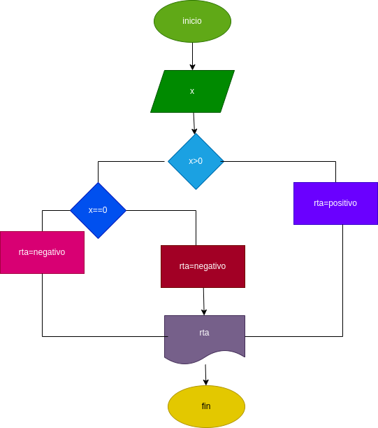

# Ejercicio No.5

## verificar si un numero es positivo, negativo o neutro

# ANALISIS

variables de entrada

x: numero ingresado

variables de salida

rta: nos va a decir si es positivo negativo o neutro

# DISEÑO

# CONSTRCCION